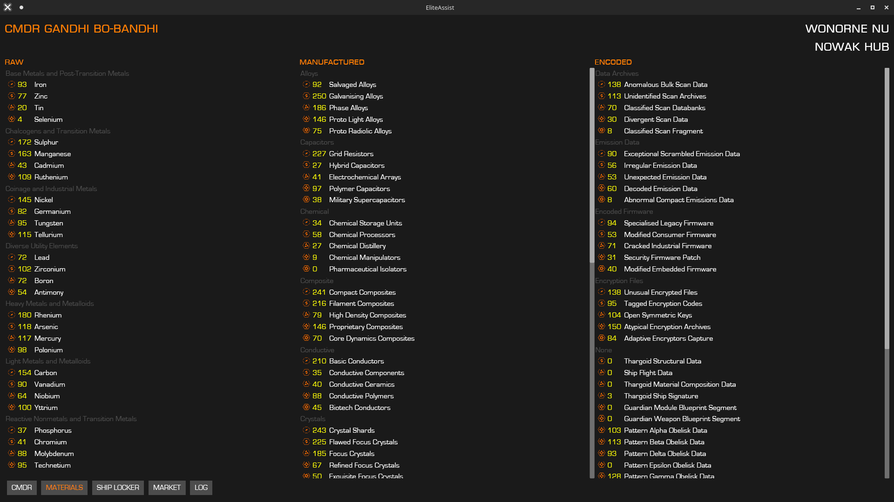
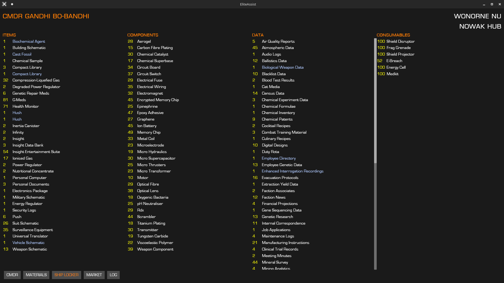
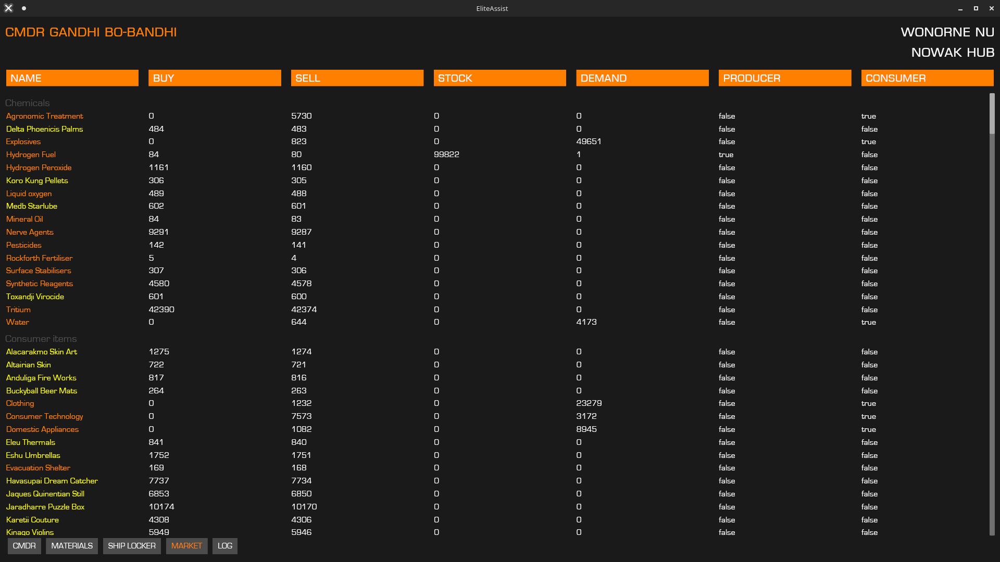
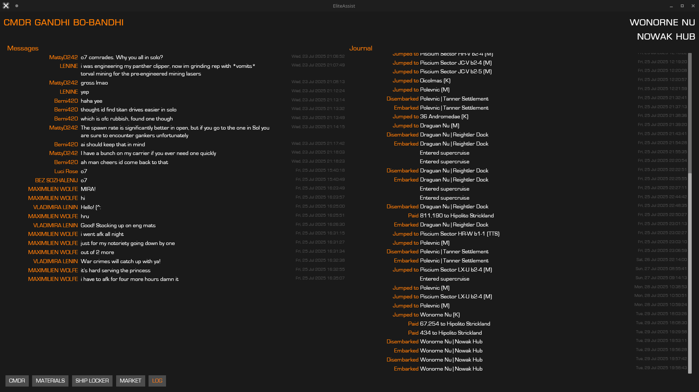

# EliteAssist
_A Linux compatible Elite:Dangerous companion for your second monitor_

## Contents

- [Features](#features)
- [How to install](#how-to-install)
- [Requirements](#requirements)
- [Current limitations](#current-limitations)
- [Contributing](#contributing)

## Features

- Overview screen with ship details, location and route data, personal details, outstanding transactions and missions:

- Details about currently owned engineering materials:

- Ship locker contents:

- A not-so-useful market details screen:

- Historical logs for chat and game events:

## How to install

Just download the latest release from [here](https://github.com/adam-drewery/EliteAssist/tags).

Remember to mark the file as executable: `chmod +x`.

## Requirements

You need [Elite:Dangerous](https://store.steampowered.com/app/359320/Elite_Dangerous/) installed via steam. The application expects the default `.steam` symlink in your home directory.

## Current limitations

- Currently the market screen only updates when you open the market in game. So... not so useful yet.
- Some journal events aren't handled yet. In particular the fleet carrier and colonization stuff.
- The UI is tested at 1920x1080 resolution and won't look so good much smaller than that.

## Contributing

Open a [pull request](https://github.com/adam-drewery/EliteAssist/pulls) or maybe start a [discussion](https://github.com/adam-drewery/EliteAssist/discussions) if you have a cool idea. If you found a bug why not [open an issue](https://github.com/adam-drewery/EliteAssist/issues).